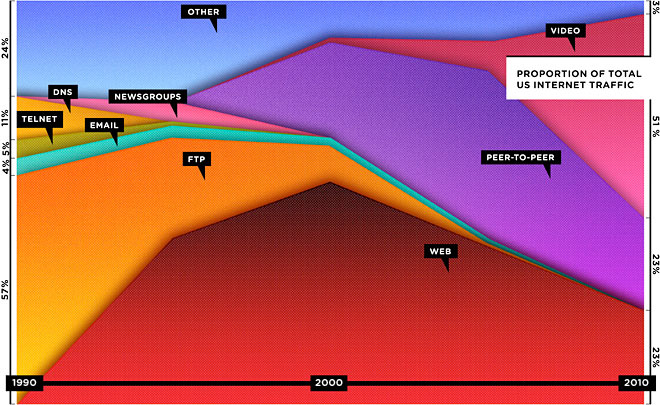

!SLIDE 

# La Web ha Muerto #

## Larga Vida a la API #

!SLIDE 
 
# Ernesto Tagwerker #

## @etagwerker ##

!SLIDE

# Ing. Sistemas (UTN) #

<!-- 
  Ingeniero en Sistemas de la Universidad Tecnológica Nacional de Buenos Aires. 
-->

!SLIDE center

# Co-Fundador #

<!-- 
  Co-Fundador de Ombu Shop, Tu Tienda Online en Minutos. Una plataforma para crear tiendas
  virtuales de una forma simple y flexible. 
-->

!SLIDE center

# Rubyista #

!SLIDE

# Desarrollador Open Source #

!SLIDE bullets incremental

# #OpenData #

<!-- 
  La idea de que ciertos datos estén disponibles y libres de uso y republicación, sin problemas de copyright o patentes.
  Esta charla se centra en OpenData centrado en el gobierno de Argentina. 
-->

* Qué está mal

<!-- 
  
  Ejemplos de sitios que no facilitan el acceso a la información generada por el Gobierno en Argentina. 
  
  Qué está mal con cada uno de los sitios y por qué está mal. 

-->

* Qué podemos hacer

<!-- 
  
  No podemos depender en el gobierno para emprender soluciones de OpenData. La iniciativa depende
  de nosotros. 
  
  Qué podemos hacer para facilitar el acceso a la información de Gobierno. 

-->

* Censo 2010 API (Argentina)

<!-- 

  Cómo se puede armar una API usando Ruby, Rubygems e ingeniería reversa sobre sitios existentes
  de Gobierno. 
  
  La posibilidad de abrir los datos sin tener que dedicarle mucho esfuerzo. Un ejemplo de las librerías
  disponibles para scrapear un sitio, armar una API y consumirla. 

-->

!SLIDE 

# The Web is Dead #

## Long Live the Internet ##

### Chris Anderson ##

<!-- 

  Un artículo muy controversial de Chris Anderson, autor de The Long Tail y Free, que menciona
  la disminución del uso de la Web para acceder al contenido disponible en Internet. 
  
  La idea de aplicarlo al Gobierno es decir: ¿Por qué siguen construyendo sitios web horribles? 
  (Si el futuro nos indica que el acceso al contenido en Internet no va a ser predominantemente Web)

-->

!SLIDE center

<!-- 
  
  Este es un gráfico del artículo de Chris Anderson que muestra que el acceso al contenido
  viene decreciendo desde 2000 hasta un 20% de todo el tráfico en Internet. 
  
-->

Fuente: http://www.wired.com/magazine/2010/08/ff_webrip/all/1