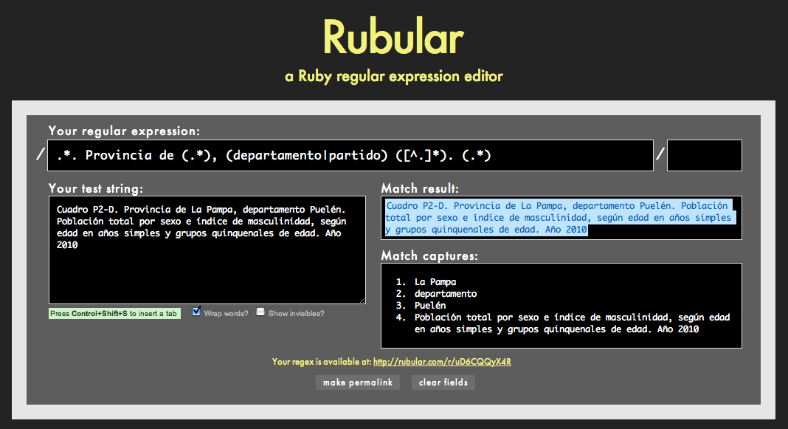
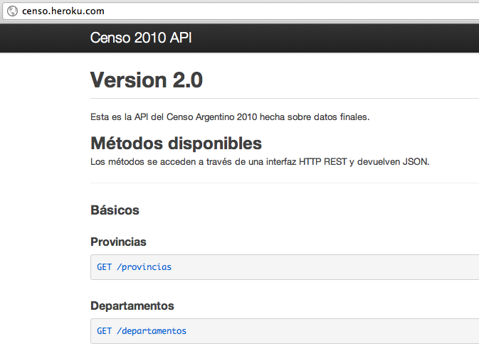
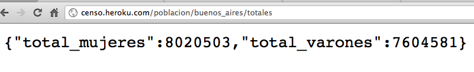
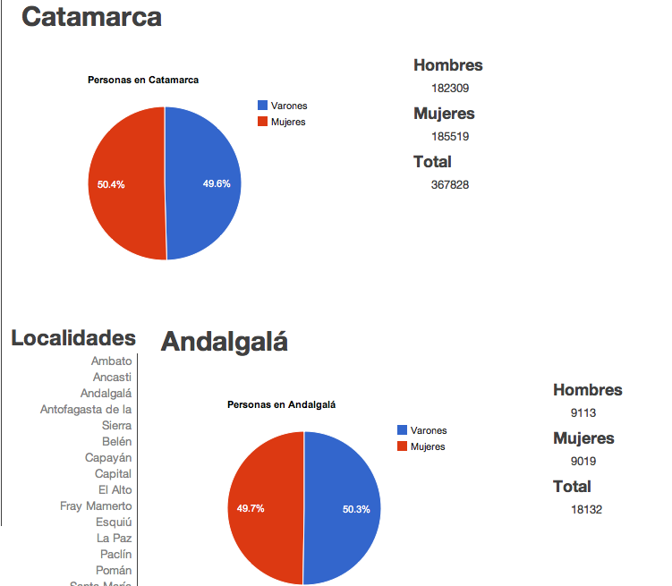

!SLIDE

# 1. Scrapeo #

    @@@ ruby

    # Bajamos todos los XLS
    xml = Hpricot::XML(
            HTTParty.get(
              "#{RESULTADOS_URL}?" + 
              "p=#{provincia_id}&" + 
              "d=#{departamento_id}&" +
              "t=#{unidad_id}"))
    (xml/:a).each_with_index do |link, index|
      uri = link.attributes['href']
      if link.innerHTML == "XLS"
        # ... # Bajo archivo XLS
      end
    end

!SLIDE

# 1. Scrapeo #

    @@@ ruby
    
    # Procesamos todos los XLS
    book = Spreadsheet.open(file_name)
    worksheet = book.worksheet(0)
    first_cell = worksheet.row(0)[0]
    if first_cell =~ PROVINCIA_CAPTURES_REGEX || 
        first_cell =~ CAPITAL_CAPTURES_REGEX
      provincia = $1
      tipo_de_depto = $2
      depto = $3
      description = $4
    end
    build_sql_dump(provincia, tipo_de_depto, 
      depto, description, ...)

!SLIDE

## Expresiones Regulares ##

  

!SLIDE

# 1. Scrapeo #

    @@@ ruby
    # Para scrapear
    gem install hpricot httparty mechanize 
    
    # Para procesar
    gem install spreadsheet

 
 
 
 
 
 

## http://github.com/etagwerker/c2010-scrapper ##
      
!SLIDE

# 2. API #

    @@@ ruby
    
    # GET /departamentos    
    Cuba.define do
      on get do
        res['Content-Type'] = 'application/json'

        on "departamentos" do
          res.write Departamento.all(
              :fields => [:nombre], 
              :unique => true, 
              :order => :nombre.asc).map { |d| 
            as_record(d.nombre) }.to_json
        end
      end
    end

!SLIDE

# 2. API #

    @@@ ruby

    # Datos de Población
    on "poblacion" do
      on ":provincia" do |pcia|
        # GET /poblacion/buenos_aires
        on "" do
          res.write(
            Departamento.find_all_by_provincia(
              sanitize(pcia)
            ).to_json
          )
        end
      end
    end

!SLIDE

# 2. API #

    @@@ ruby
    
    # GET /poblacion/buenos_aires/totales
    on "totales" do
      res.write(
        Departamento.population_totals_for(
          :provincia => sanitize(pcia)).to_json)
    end

!SLIDE

# 2. API #

## http://censo.heroku.com ##

  

!SLIDE

# 2. API #

## GET /poblacion/buenos_aires/totales ##

  

!SLIDE

# 2. API #

## GET /poblacion/buenos_aires ##

  

!SLIDE bullets incremental

# 3. Visualización #

* jQuery

* Backbone.js

* Batman.js

!SLIDE bullets incremental

# 3. Visualización #

* Backbone.js

* HTML

* CSS

* Censo API

!SLIDE 

# 3. Visualización #

    @@@ javascript
    
    // Modelo de Provincia 
    window.Provincia = 
      Backbone.Model.extend({
        population_url: function() {
          return '/poblacion/' 
              + tidy_id(this.get('id')) 
              + "/totales?callback=?";  
        }, ...
      
!SLIDE 

# 3. Visualización #

    @@@ javascript

    // Modelo de Departamento
    window.Departamento = 
      Backbone.Model.extend({
        population_url: function() {
          var pcia = this.get('provincia');
          return '/poblacion/' 
              + tidy_id(pcia.get('id')) + '/' 
              + tidy_id(this.get('id')) 
              + "/totales?callback=?";  
        }, ...

!SLIDE 

# 3. Visualización #

    @@@ javascript

    // Vista de Población de Provincia
    window.ProvinciaPopulationView = 
    Backbone.View.extend({
      population_graph: function(population) {
        ...
        var chart = 
          new google.visualization.PieChart(el);
        var area = population.get('area');
        chart.draw(data, {title: 
            'Personas en ' + area.get('nombre') });
      }, ...
      
      window.AppView = Backbone.View.extend({
        el: $("#charts-app"),

!SLIDE 

# 3. Visualización #

    @@@ javascript
    
    window.AppView = Backbone.View.extend({
      el: $("#charts-app"),
      initialize: function() {
        window.Provincias.fetch({
          success: function() {
            new ProvinciasView;
          }
        });
      }
      
!SLIDE       
          
# 3. Visualización #

    @@@ javascript

    // Finalmente! 
    window.App = new AppView;
    
!SLIDE

# Backbone.js UI #

  

