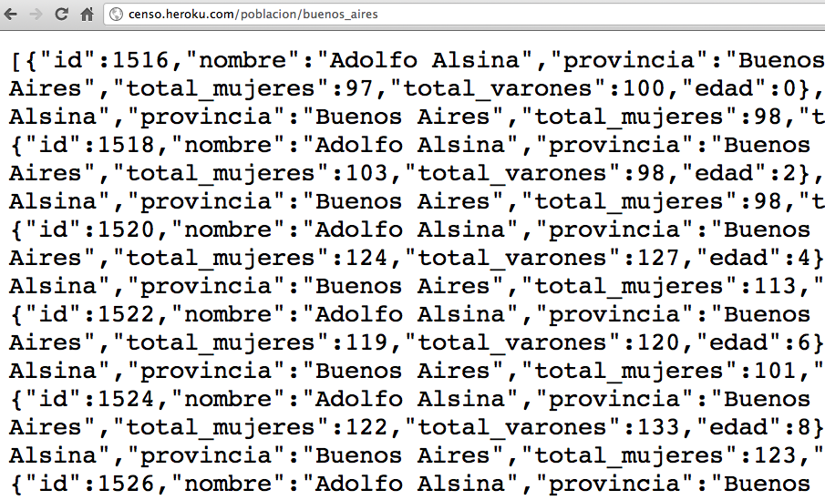
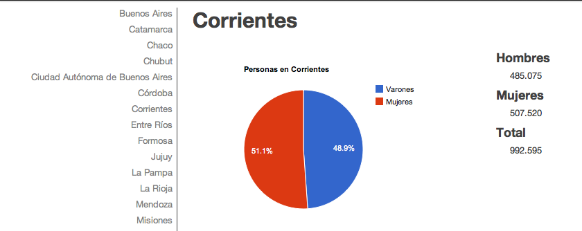
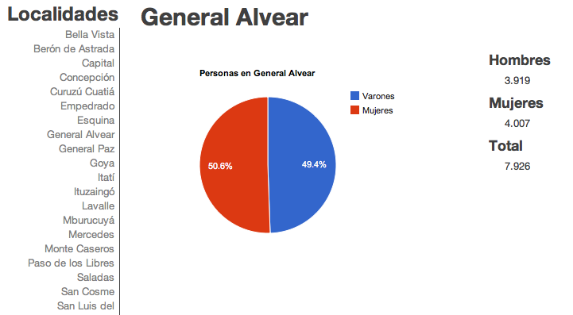
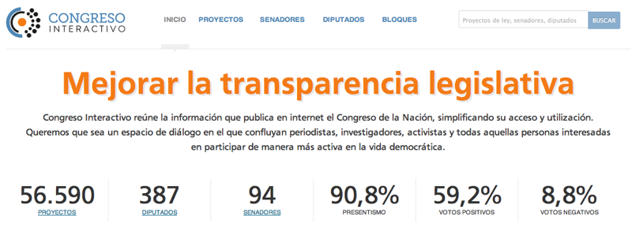
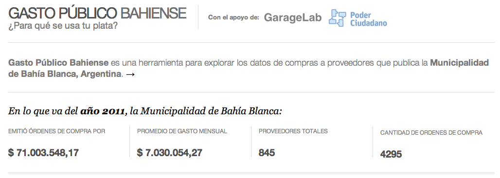
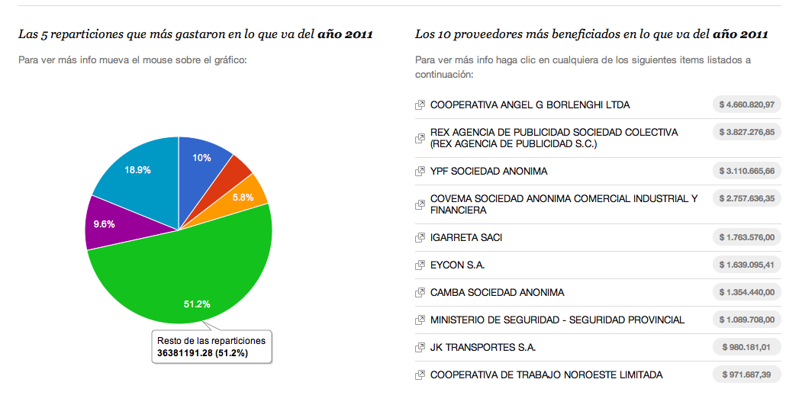

!SLIDE

# 1. Scrapeo #

    @@@ ruby

    # Bajamos todos los XLS
    xml = Hpricot::XML(
            HTTParty.get(
              "#{RESULTADOS_URL}?" + 
              "p=#{provincia_id}&" + 
              "d=#{departamento_id}&" +
              "t=#{unidad_id}"))
    (xml/:a).each_with_index do |link, index|
      uri = link.attributes['href']
      if link.innerHTML == "XLS"
        # ... # Bajo archivo XLS
      end
    end

!SLIDE

# 1. Scrapeo #

    @@@ ruby
    
    # Procesamos todos los XLS
    book = Spreadsheet.open(file_name)
    worksheet = book.worksheet(0)
    first_cell = worksheet.row(0)[0]
    if first_cell =~ PROVINCIA_CAPTURES_REGEX || 
        first_cell =~ CAPITAL_CAPTURES_REGEX
      provincia = $1
      tipo_de_depto = $2
      depto = $3
      description = $4
    end
    build_sql_dump(provincia, tipo_de_depto, 
      depto, description, ...)

!SLIDE

# 1. Scrapeo #

    @@@ ruby
    # Ruby
    ruby-1.8.7
    
    # Para scrapear
    gem install hpricot httparty mechanize 
    
    # Para procesar
    gem install spreadsheet

 
 
 
 
 
 

## http://github.com/etagwerker/c2010-scrapper ##

!SLIDE

# 2. API #

    @@@ ruby

    # Datos de Población
    on "poblacion" do
      on ":provincia" do |pcia|
        # GET /poblacion/buenos_aires
        on "" do
          res.write(
            Departamento.find_all_by_provincia(
              sanitize(pcia)
            ).to_json
          )
        end
      end
    end

!SLIDE

# 2. API #

    @@@ ruby
    
    # GET /poblacion/buenos_aires/totales
    on "totales" do
      res.write(
        Departamento.population_totals_for(
          :provincia => sanitize(pcia)).to_json)
    end

!SLIDE center

# 2. API #

    GET /poblacion/buenos_aires/totales

    {"total_mujeres" : 8020503, 
    "total_varones" : 7604581}

!SLIDE center

# 2. API #

## GET /poblacion/buenos_aires ##

!SLIDE

# 2. API #

    @@@ ruby
    # Ruby
    ruby-1.9.2
    
    # Para API HTTP/JSONP
    gem install cuba rack-jsonp data_mapper 
    
    # Para documentación
    gem install haml
    
    # CSS
    Bootstrap by Twitter

 
 
 
 
 
 

## http://github.com/etagwerker/censo2010/tree/v2 ##

!SLIDE bullets

# 3. Visualización #

* jQuery

* Backbone.js

* Batman.js

!SLIDE bullets

# 3. Visualización #

* Backbone.js

* HTML

* CSS

* Censo API

!SLIDE 

# 3. Visualización #

    @@@ javascript
    
    // Modelo de Provincia 
    window.Provincia = 
      Backbone.Model.extend({
        population_url: function() {
          return '/poblacion/' 
              + tidy_id(this.get('id')) 
              + "/totales?callback=?";  
        }, ...

!SLIDE 

# 3. Visualización #

    @@@ javascript
    
    window.AppView = Backbone.View.extend({
      el: $("#charts-app"),
      initialize: function() {
        window.Provincias.fetch({
          success: function() {
            new ProvinciasView;
          }
        });
      }
      
!SLIDE       
          
# 3. Visualización #

    @@@ javascript

    // Finalmente! 
    window.App = new AppView;
    
!SLIDE center

# Backbone.js UI  #

## Población por Provincia ##

!SLIDE center

# Backbone.js UI  #

## Población por Localidad ##

!SLIDE center

# Congreso Interactivo #

!SLIDE center

# Gasto Público Bahiense #

## Bahía Blanca ##

!SLIDE center

# Gasto Público Bahiense #

## A dónde va el dinero ##

