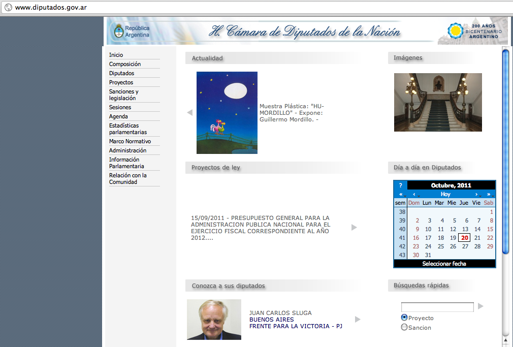

!SLIDE bullets incremental

# Títulos Alternativos #

* "Basta de Sitios Horribles"

<!-- 

  Por qué empecé a ver sitios del Gobierno Argentino que eran horribles. No se centraban
  en proveer acceso al contenido, ni compartirlo ni hacerlo fácil de acceder. 
  
  A continuación veremos algunos ejemplos.

-->

* "Cómo NO ocultar información"

<!-- 

  Algunos sitios parece que ocultan información a propósito. Como que el objetivo de dicho 
  sitio fuera NO proveer nigún tipo de información relevante. 

-->

* "The Walking Dead: Sitios Zombie"

<!-- 

  Porque al final de la presentación veremos algo de código para construir tu propia API. 
  Además recorreremos los tres pasos para construir sitios gubernamentales accesibles en
  el futuro. 

-->

!SLIDE bullets incremental

# Ejemplos de Sitios

* Ejecución Presupuestaria Nacional

<!-- 

  Este sitio parece una broma de mal gusto. Como que no quisieran que el pueblo siga
  con facilidad la ejecución presupuestaria de gobierno. 
  
-->

* Cámara de Diputados (Congreso)

<!-- 

  La homepage de esta página no hace énfasis en los datos más importantes del sitio: 
  Qué se está tratando, Quién lo está tratando, Cómo están votando, Por qué, Qué están discutiendo

-->

* Censo 2010

<!-- 

  El mejorcito de los últimos sitios de gobierno. Aún así provee archivos .xls (Excel) 
  con mucha información de viviendas, hogares y población de la República Argentina.

-->

!SLIDE center

## Ejecución Presupuestaria Nacional ##

!SLIDE center

## Detalles de Ejecución (Java Applet) ##

!SLIDE center

## Cámara de Diputados ##

!SLIDE center

## Sección de Proyectos en Cámara de Diputados ##

!SLIDE center

## Datos del Censo 2010 ##

